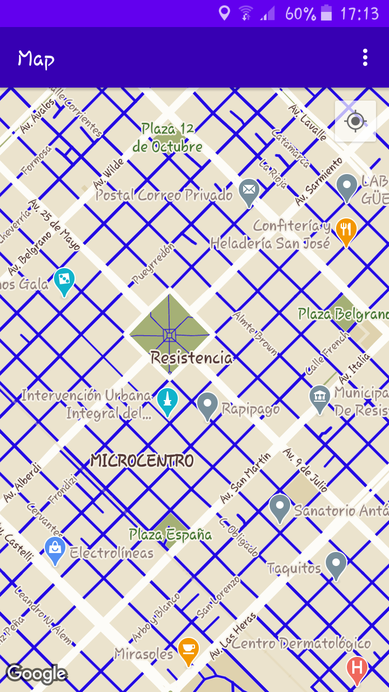
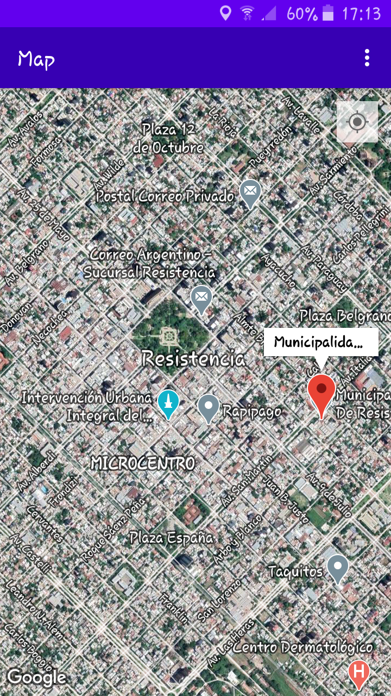
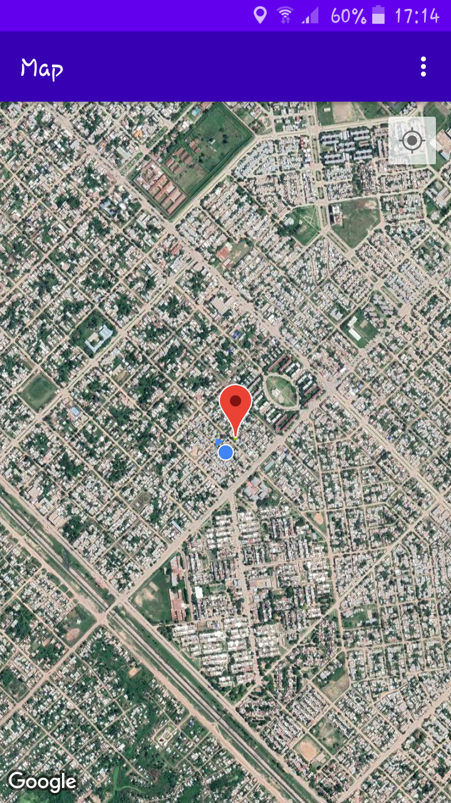

Wander
=======================================

##Skills acquired
1. Integrate a Google Map in your app.
2. Display different map types.
3. Style the Google Map.
4. Add markers to your map.
5. Enable the user to place a marker on a point of interest (POI).
6. Enable location tracking.
7. Enable Google Street View.

## Screenshots

